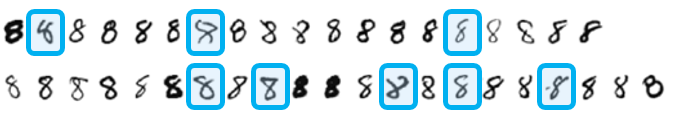

# 기계 학습 소개

## 1. 기계 학습이란

### 기계 학습의 정의

데이터를 기반으로 학습하여, 특정 작업의 성능을 최적화하거나 예측의 정확도를 높이는 컴퓨터 프로그램을 만드는 작업

### 지식 기반 학습→기계 학습으로 대전환

초창기 인공지능은 사람이 인식할 때 사용할 것 같은 규칙을 이용하는 지식 기반 방식을 사용 → 그러나 이를 벗어나는 샘플들이 발생

Ex) “구멍이 2개고 맨 위와 아래가 둥근 모양이면 8이다”라는 규칙을 생성

→ 이를 벗어나는 샘플들도 발생

→ 인공지능의 패러다임이 컴퓨터가 직접 데이터를 중심으로 규칙을 학습하는 **기계 학습**으로 넘어감

### 기계 학습 개념

기계 학습은 주어진 특징들을 분석하여 목표치를 예측하는 기술

예측 문제는 크게 회귀와 분류로 나뉨

1. 회귀(Regression) : 연속된 실숫값을 예측하는 문제
    
    
    
2. 분류(Classification) : 입력에 대한 부류를 예측하는 문제

기계 학습의 핵심 : 데이터를 가장 잘 설명하는 모델을 만드는 것. 이때 모델은 일종의 수학적 틀을 뜻함

- 모델 선택 : 데이터의 분포가 직선 형태라면 직선 모델 선택, 곡선 형태라면 2차 이상의 곡선 모델 선택
- 매개변수 : 직선 모델은 y = wx + b로 표현되고 여기서 직선의 모양을 결정하는 w와 b를 매개변수라고 정의
- 기계 학습이란 데이터를 가장 정확하게 예측할 수 있는 **최적의 매개변수(w, b) 값**을 찾아내는 작업

**기계 학습의 최종 목표**는 훈련 집합에 없는 새로운 샘플에 대한 오류를 최소화 하는 것

## 2. 특징 공간에 대한 이해

### 특징 공간이란

특징 공간 : 특징과 그에 대응하는 목표값의 쌍으로 이루어진 값들이 존재하는 공간

차원의 개수 : 특징 공간의 차원은 특징의 개수에 의해 결정(n개의 특징을 가진 특징 공간은 n차원)

### 다차원 특징 공간

현실의 데이터는 1,2차원 같이 낮은 차원이 아닌 매우 높은 차원의 특징 공간에 존재

Ex1) Haberman Survival 데이터셋 같은 경우 환자의 나이, 수술 연도, 양성 림프샘 개수
라는 세 가지 변수로 구성되어 있어 **3차원 특징 공간**을 형성

Ex2) MNIST 데이터셋 같은 경우 이미지 크기가 28x28 픽셀 크기의 이미지를 사용하므로 **784차원의 특징 공간**을 형성

**모델별 필요한 매개변수 수 비교**

1. 직선 모델을 사용하는 경우의 매개 변수 개수
    1. 수식
        
        
        
    2. 필요한 매개 변수 개수 : d + 1개
2. 2차원 곡선 모델을 사용하는 경우의 매개 변수 개수
    1. 수식
        
        
        
    2. 매개변수 개수 : d^2 + d + 1개

### 특징 공간 변환과 표현 학습

특징 공간 변환 

- 데이터를 더 정확하게 분류하고 학습하기 위해 데이터가 존재하는 공간을 변환하는 과정
- 원래의 특징 공간에서는 데이터가 섞여 있음 → 직선 하나로 100퍼센트 완벽하게 분류하기 어려운 경우 많음
- 적절한 수식을 통해 특징 공간을 변환함으로써 복잡하게 얽힌 데이터들이 새로운 공간에서는 직선으로 깔끔하게 구분 가능 → 분류 성능의 극대화!

차원의 저주

- 차원이 증가할 수록 공간의 부피가 늘어나 데이터의 밀도가 희박해지는 현상
- 데이터 사이의 공간이 멀어져 학습이 어려워지고 이를 해결하려면 훨씬 더 많은 양의 훈련 데이터가 필요
- 훈련 집합의 밀도가 충분히 높아질 때까지 데이터의 개수를 늘리거나, **주성분 분석(PCA) 특이값 분해(SVD)와 같이 데이터의 핵심을 유지하면서 불필요한 차원을 줄이는 차원 축소**를 통해 해결 가능

표현 학습

- 기계가 데이터로부터 자동으로 유용한 정보를 추출해내는 과정
- 딥러닝은 표현 학습을 통해 최적의 성능을 발휘할 수 있는 좋은 특징 공간을 찾아냄

## 3. 데이터에 대한 이해

### 데이터베이스의 중요성

기계 학습은 결국 데이터를 통해 원리를 역추정하는 과정 → 데이터의 질이 매우 중요!

특정 조건의 데이터로만 학습하면 다른 조건에서는 성능이 떨어짐 → 실제 응용 환경에 맞는 다양한 조건의 데이터 수집이 필요

기계 학습 알고리즘 성능 테스트에 사용되는 3가지 주요 데이터 베이스

### 데이터베이스 크기와 기계 학습 성능

- MNIST 이미지가 가질 수 있는 이론적 경우의 수는 2의 784제곱개로 우주의 크기만큼 방대 → 하지만 실제 학습 데이터는 6만개 뿐
    
    
    
- 그러나 방대한 공간에서 숫자 형태를 띄는 데이터는 극히 일부이며 샘플 데이터는 일정한 규칙에 따라 매끄럽게 변화
    
    
    

→ 데이터 분포를 잘 표현하는 특징 공간으로 변환한다면 복잡하지 않은 모델로도 높은 성능을 내는 것이 가능!

## 4. 간단한 기계 학습의 예

### 목적 함수

1. 목적 함수란?
    1. 모델이 학습할 때 발생하는 비용(=Cost), 오류(=Error)을 측정하는 함수
    2. 비용 함수, 손실 함수, 오차 함수 등으로도 불림
    3. 기계 학습은 목적 함수의 값이 0에 수렴하도록 최소화 되는 방향으로 매개변수를 조정하며 학습
        
        → 이를 Optimization, 최적화라고도 함
        
2. 선형회귀에서의 목적 함수
    1. 선형 회귀 : 직선 모델을 사용하여 데이터를 예측하는 기계 학습 알고리즘으로 평균제곱오차(MSE)와 유사
        
        
        
    2. 학습 과정
        1. 초기에는 최적값을 모르므로 난수로 초기 매개변수 설정
        2. 목적 함수 값을 계산하여 오차 확인
        3. 오차가 줄어드는 방향으로 매개변수 반복적으로 개선하여 최적의 모델 탐색
3. 최적해를 찾는 방법
    1. 수치적 방법 : 미분을 통해 오차가 작아지는 방향을 구해 매개변수를 조금씩 반복적으로 업데이트
        
        
        
    2. 분석적 방법 : 수학적으로 미분값이 0이 되는 수식을 전개하여 한 번의 계산으로 최적해 탐색

## 5. 모델 선택

### 과소적합과 과잉적합

1. **과소적합(Underfitting)**
    - 모델이 너무 단순하여 내재된 구조나 패턴이 제대로 학습하지 못하는 상태
    - 매개변수가 더 많은 복잡한 모델을 선택하거나 규제 기법을 감소하는 등의 해결 방법을 통해 해결
2. **과잉적합(Overfitting)**
    - 모델이 필요 이상으로 복잡하게 훈련하여 훈련 데이터의 잡음까지 학습해버린 상태
    - 훈련 데이터에 대한 성능은 매우 높으나 새로운 데이터에 대한 예측 성능은 떨어짐
    - 더 많은 훈련 데이터를 수집하고 규제 기법을 적용해서 모델의 복잡도를 조정하는 등의 방법을 통해 해결

### 바이어스와 분산

1. 바이어스(Bias)
    - 예측값과 실제 정답이 얼마나 떨어져 있는가를 나타냄
    - 바이어스가 높음 → 모델이 정답을 제대로 맞히지 못 하는 상태
2. 분산
    - 예측값들이 서로 얼마나 흩어져 있는가를 나타냄
    - 분산이 높을 시 훈련 데이터가 조금만 바뀌어도 예측 결과가 크게 바뀜

### 검증집합과 교차검증을 이용한 모델 선택 알고리즘

여러 후보 모델을 정하고 그 중 가장 성능이 좋은 모델을 선택하는 과정이 필요

1. 검증 집합을 사용하는 방법
    - 전체 데이터를 훈련, 검증, 테스트 3개로 나누고 모델을 훈련 집합으로 학습 시키고 검증 집합으로 성능을 측정해 최적의 모델 선택
        
        
        
2. 교차 검증을 이용하는 방법
    
    
    
3. 부트스트랩을 이용하는 방법

## 6. 규제

### 규제란

1. 규제란? : 모델을 단순하게 유지하여 과잉적합의 위험을 줄이는 행위
2. 하이퍼파라미터란? : 모델이 스스로 학습하는 매개변수가 아니라 사람이 학습 전 미리 설정해두는 변수

### 데이터 확대

- 데이터 양은 를려 일반화 성능을 높이는 방법
- 샘플이 20개인 경우 과잉적합이 심하게 발생하여 그래프가 요동침, 그러나 샘플이 60개로 많을 때는 원래의 패턴을 더 정확하게 예측

### 가중치 감쇠

- 규제의 구체적인 구현 방법 중 하나로 가중치 값을 작게 유지하는 기법

## 7. 기계 학습 유형

### 지도 학습에 따른 유형

지도 학습 : 문제와 정답을 모두 주고 학습 → 정답 맞히는 예측 모델 생성

비지도 학습 : 정답 없이 데이터만 주고 학습 → 데이터 간 유사성 찾아 군집화

강화 학습 : 행동에 대한 보상과 벌 제공 → 보상 최대화하고 벌을 최소화 하는 최적의 행동방식 학습

준지도 학습 : 소량의 정답 데이터와 대량의 정답 없는 데이터 함께 사용

### 다양한 기준에 따른 유형

- 데이터가 들어오는 방식과 학습 시점에 따라 오프라인 학습/온라인 학습 분류
- 데이터를 단순히 분류하는 지, 아니면 새로운 데이터를 만들어 내는 지에 따라 분별 모델과 생성 모델로 분류
- 동일한 데이터로 다시 학습했을 때 결과가 같은 지에 따라 결정론적 학습과 스토캐스틱 학습으로 분류