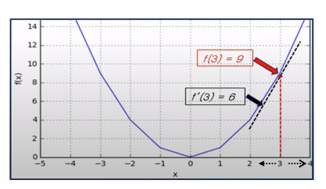

# 기계 학습과 수학

## 최적화

1. 목적 함수
    - 비용 함수 또는 손실 함수라고도 불리며 **기계 학습이 얼마나 잘 작동하는 지를 측정하는 기준 함수**
    - 신경망의 **오차**를 측정하는 함수
    - 오차 = 실제 값(정답) - 예측 값(모델의 출력)
2. 기계 학습의 핵심과 미분
    - 최적화 : 목적 함수를 최소화 하는 모델의 매개변수를 찾아내는 과정
    - 오차를 줄이기 위해 **매개변수를 어떻게 움직여야 하는 지를 찾기 위해 미분을 사용**해 극점을 찾음
    
    
    
3. 최적화 알고리즘의 종류
    - 경사 하강법
    - 뉴턴/준 뉴턴 방법
    - 스토캐스틱 경사하강법
    - 모멘텀
    - AdaGrad
    - Adam
    - RMSprop
    - 역전파(Backpropagation)

## 매개변수 공간의 탐색

1. 학습 모델의 매개변수 공간
    - 문제점
        - 특징 공간에서의 확률 분포를 정확하게 추론 가능하다면 분류 문제 해결 가능
        - 그러나 실제 데이터는 고차원에 정의된 희소 데이터에 불가
    - 해결책
        - 따라서 기계 학습은 특징 공간이 아닌 매개변수 공간을 탐색!
2. 기계 학습의 전략
    - 적절한 모델 탐색 → 목적 함수 정의 → 모델의 매개변수 공간 탐색 → 목적 함수의 최저점 탐색
        
        
        
3. 최적화 문제 해결 방법
    1. 공간 탐색 방법
        - 낱낱 탐색 : 해 공간 전체를 샅샅이 뒤짐, 차원이 높아지면 계산 불가
        - 무작위 탐색 : 무작위로 점을 선택해 탐색, 반복을 멈출 **멈춤 조건**이 필요
    2. 최적해 계산 방법
        - 수치적 방법 : 현재 위치에서 내려가는 방향을 찾아 조금씩 이동하며 반복적으로 해를 사용, 딥러닝에서 주로 사용!
        - 분석적 방법 : **도함수 = 0**과 같은 수식을 전개하여 한번에 해를 구함
4. 최적해의 종류
    - 전역 최적해 : 정의역 전체에서 가장 최소인 점으로 고차원 공간에서는 찾기 힘듦
    - 지역 최적해 : 특정 근방에서는 최적이지만 전체로 보면 최적이 아닌 점
        
        
        

## 미분

1. 미분에 의한 최적화
    1. 1차 미분
        - 어떤 점에서의 **기울기**를 뜻하며 $-f'(x)$ 방향으로 이동 시 최저점 찾기 가능
    2. 2차 미분
        - 기울기가 0인 지점이 최소점인지 최대점인지 판별하기 위해 사용
        
        
        
2. 편미분과 그레디언트
    - 편미분 : 특정 변수 하나에 대해서만 미분하고 나머지 변수는 상수 취급
    - 그레디언트 : 각 변수에 대해 편미분 한 값을 모은 벡터
    - 그레디언트의 반대 방향으로 이동 시 최저점 찾기 가능!
        
        
        
3. 연쇄 법칙
    - 합성합수의 미분을 겉미분과 속미분의 곱으로 표현
    
    $$
    f(g(x))' = f'(g(x))g'(x)
    $$
    
    - 다중 퍼셉트론(MLP) 학습에서 신경망은 여러 층의 함수가 중첩된 상태이므로 입력에서 출력까지 가는 과정에서 가중치가 미치는 영향을 파악하기 위해 연쇄 법칙 사용
    
    
    
4. 야코비안과 헤시안
    
    함수의 식을 온전히 알고 있을 때 더욱 정교하게 최적화 하기 위한 행렬들
    
    - 야코비안 행렬
        - 입력이 d차원 벡터이고 출력이 m차원 벡터인 다변수 벡터 함수를 미분하여 행렬로 표현한 것
        
        
        
    - 헤시안 행렬
        - 함수의 2차 편미분 결과들을 행렬 형태로 배치한 것
        
        
        
5. 테일러 급수
    - 복잡하거나 알 수 없는 함수들을 다항 함수로 근사하여 표현하는 방법
    
    $$
    f(x + \Delta) \approx f(x) + f'(x)\Delta + \frac{f''(x)}{2!}\Delta^2 + \dots
    $$
    

## 최적화 알고리즘

1. 경사 하강법
    - 손실 함수의 감소 방향을 찾아 조금씩 이동하며 최적의 해를 찾아가는 과정
    
    $$
    \theta = \theta - \rho g
    $$
    
2. 뉴턴/준 뉴턴 방법
    - 1차 미분 뿐만 아니라 2차 미분까지 사용하여 최적의 이동 크기를 수학적으로 찾아내는 방법
3. 모멘텀
    - 경사 하강법에 관성을 추가하여 지그재그 현상을 줄이고 서 부드럽고 빠르게 이동
    
    
    
4. AdaGrad
    - 변화가 적은 변수는 학습률을 크게, 변화가 많은 변수는 학습률을 작게 조절
    
    
    
5. RMSprop
    - AdaGrad의 단점을 해결하기 위해 **지수 이동 평균(EMA)**를 부여
    - 과거의 기울기 영향력을 줄이고 최근 기울기를 더 잘 반영하도록 함
6. Adam
    - 모멘텀 + RMSprop 방식을 합친 최적화 알고리즘으로 모멘텀 처럼 지그재그가 감소하여 부드럽게 이동하고 RMSprop처럼 지수 이동 평균 값을 사용
    - 현재 가장 널리 사용되는 최적화 알고리즘

